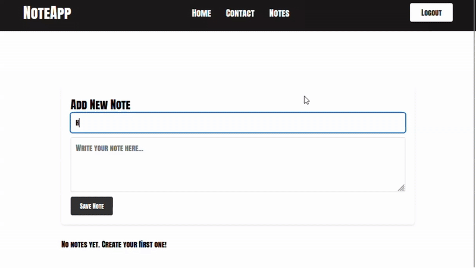
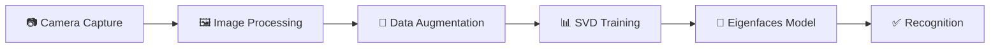

<div align="center">

# 🔐 FaceAuth Notes

### *Secure, Camera-Based Authentication for Your Personal Notes*

[](https://python.org)
[](https://djangoproject.com)
[](https://opencv.org)
[](https://docker.com)
[](LICENSE)

---

**FaceAuth Notes** is a cutting-edge web application that combines **face recognition authentication** with a **personal notes manager**. Forget passwords—just look at your camera to securely access your notes!

[✨ Features](#-features) •
[🚀 Quick Start](#-quick-start) •
[📸 Demo](#-demo) •
[🏗️ Architecture](#️-architecture) •
[🔧 Tech Stack](#-tech-stack)

</div>

---

## 📸 Demo

### 🎬 Sign Up & First Run

> Watch how easy it is to set up the project and create your first account using face recognition!

<div align="center">


</div>

**What you'll see:**
- 🖥️ Starting the Django development server
- 📷 Capturing face data through the camera widget
- ✅ Creating a new user with face authentication
- 🔄 Automatic face model training

---

### 🎬 Login, Notes & Logout

> Experience the full workflow: logging in with your face, managing notes, and secure logout!

<div align="center">



</div>

**What you'll see:**
- 🔓 Seamless face-based login authentication
- 📝 Creating, viewing, and deleting personal notes
- 🚪 Secure logout functionality
- 🔐 User-specific notes isolation

---

## ✨ Features

<table>
<tr>
<td width="50%">

### 🎯 **Face Authentication**
- **Camera-based signup** — No passwords needed
- **Eigenfaces algorithm** — Powered by SVD
- **Data augmentation** — 8 auto-generated variations per face
- **Real-time recognition** — Fast & accurate login

</td>
<td width="50%">

### 📓 **Personal Notes**
- **Create & manage** — Simple, intuitive interface
- **User isolation** — Your notes are yours only
- **Timestamps** — Track when notes were created
- **Quick delete** — Remove notes with one click

</td>
</tr>
<tr>
<td width="50%">

### 🐳 **Docker Ready**
- **One-command setup** — Get running in seconds
- **Consistent environment** — Works everywhere
- **Volume mounting** — Persist your data
- **Production-ready** — Easy deployment

</td>
<td width="50%">

### 🎨 **Modern UI**
- **Responsive design** — Works on all devices
- **Clean interface** — Focus on what matters
- **Font Awesome icons** — Beautiful visual elements
- **Poppins font** — Premium typography

</td>
</tr>
</table>

---

## 🚀 Quick Start

### Option 1: 🐳 Docker (Recommended)

The fastest way to get started! Just two commands:

```bash
# Clone the repository
git clone https://github.com/YADUNANDAN-SINGH/django-svd-face-auth.git
cd django-svd-face-auth

# Start with Docker Compose
docker-compose up --build
```

🎉 **That's it!** Open your browser and navigate to:
```
http://127.0.0.1:8000/
```

---

### Option 2: 🐍 Manual Setup

<details>
<summary>Click to expand manual installation steps</summary>

#### Prerequisites
- Python 3.10+
- pip (Python package manager)
- Webcam access

#### Step-by-Step

```bash
# 1. Clone the repository
git clone https://github.com/YADUNANDAN-SINGH/django-svd-face-auth.git
cd django-svd-face-auth

# 2. Create virtual environment
python -m venv venv

# 3. Activate virtual environment
# Windows:
venv\Scripts\activate
# macOS/Linux:
source venv/bin/activate

# 4. Install dependencies
pip install -r web_app/face_recognization_notes_app/requirements.txt

# 5. Navigate to Django app
cd web_app/face_recognization_notes_app

# 6. Run migrations
python manage.py migrate

# 7. Start the server
python manage.py runserver
```

🌐 Open **http://127.0.0.1:8000/** in your browser!

</details>

---

## 🏗️ Architecture

```
📦 FaceAuth-Notes
├── 🧠 math_engine/              # Face Recognition Core
│   ├── augmenter.py            # Image augmentation (8 variations)
│   ├── trainer.py              # Eigenfaces model training
│   ├── inference.py            # Face recognition logic
│   └── face_model.pkl          # Trained model file
│
├── 🌐 web_app/                  # Django Application
│   └── face_recognization_notes_app/
│       ├── accounts/           # Authentication (signup/login)
│       ├── notes/              # Notes management
│       ├── templates/          # HTML templates
│       ├── static/             # CSS, JS, assets
│       └── media/faces/        # Stored face images
│
├── 🐳 Docker Files
│   ├── Dockerfile
│   └── docker-compose.yml
│
└── 📖 README.md
```

---

## 🔬 How It Works

<div align="center">



</div>

### The Science Behind FaceAuth

| Step | Description |
|------|-------------|
| **1. Capture** | User's face is captured via webcam in the browser |
| **2. Augment** | 8 variations are generated (flip, brightness, blur, etc.) |
| **3. Flatten** | Images are converted to 100x100 grayscale vectors |
| **4. SVD** | Singular Value Decomposition extracts principal components |
| **5. Train** | Eigenfaces and weights are stored in `face_model.pkl` |
| **6. Match** | New faces are projected & matched using Euclidean distance |

---

## 🔧 Tech Stack

<div align="center">

| Technology | Purpose |
|------------|---------|
|  | Core language |
|  | Web application |
|  | Face detection & processing |
|  | SVD & matrix operations |
|  | Easy deployment |
|  | Data persistence |

</div>

---

## 📁 Key Files

| File | Description |
|------|-------------|
| `math_engine/trainer.py` | Trains the Eigenfaces model using SVD |
| `math_engine/inference.py` | Recognizes faces against trained model |
| `math_engine/augmenter.py` | Generates 8 image variations for robust training |
| `notes/views.py` | Handles notes CRUD operations |
| `accounts/templates/` | Login & signup UI with camera widget |

---

## 🛠️ Configuration

### Environment Variables

| Variable | Default | Description |
|----------|---------|-------------|
| `DEBUG` | `1` | Enable debug mode (set to `0` in production) |
| `PORT` | `8000` | Server port |

### Recognition Threshold

Adjust face matching sensitivity in `math_engine/inference.py`:

```python
def recognize_face(image_path, threshold=2000):  # Lower = stricter
```

---

## 🤝 Contributing

Contributions are welcome! Here's how you can help:

1. 🍴 **Fork** the repository
2. 🌿 Create a **feature branch** (`git checkout -b feature/amazing`)
3. 💾 **Commit** your changes (`git commit -m 'Add amazing feature'`)
4. 📤 **Push** to the branch (`git push origin feature/amazing`)
5. 🔃 Open a **Pull Request**

---

## 📄 License

This project is licensed under the **MIT License** — see the [LICENSE](LICENSE) file for details.

---

<div align="center">

### ⭐ Star this repo if you found it helpful!

**Made with ❤️ and a lot of ☕**

[🔝 Back to Top](#-faceauth-notes)

</div>
